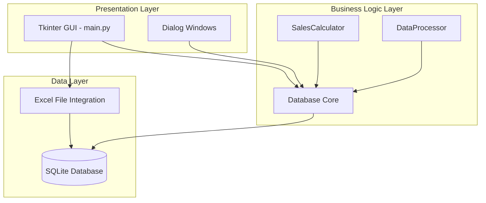
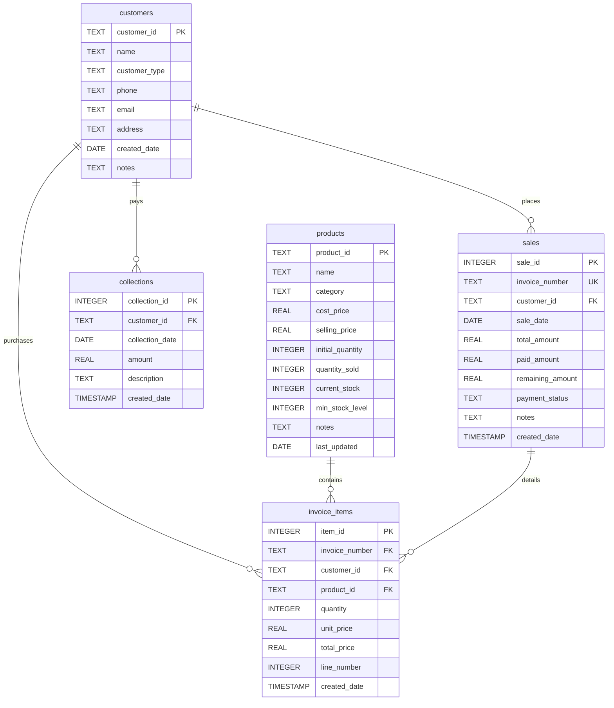
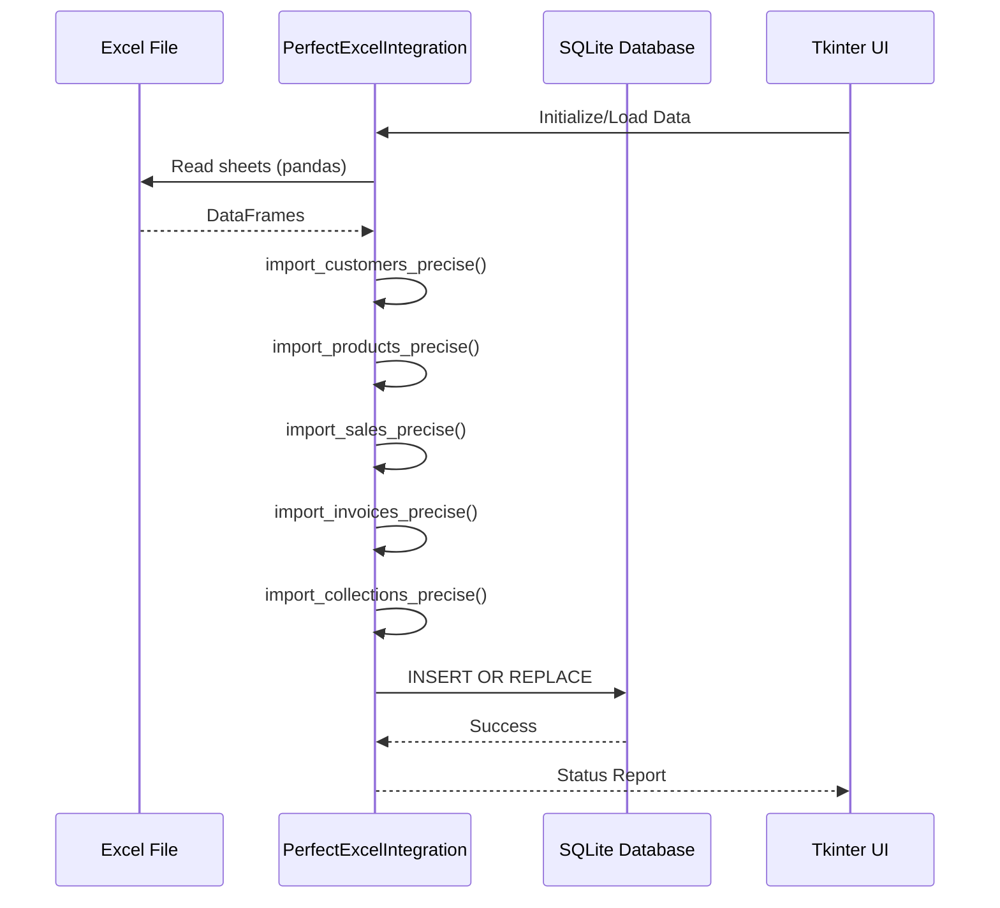

# Sales System - Complete Technical Analysis

## Executive Summary

This is a **Sales & Inventory Management System** built with Python, using Tkinter for the desktop GUI and SQLite for data persistence. The system integrates with an Excel file (`كشف البظاعة الحقيقي.xlsx`) as the primary data source, providing a bidirectional sync between Excel and a local database.

**System Type:** Desktop Application (Tkinter-based)  
**Language:** Python 3  
**Database:** SQLite (`perfect_sales_system.db`)  
**Data Integration:** Excel (`.xlsx`) via pandas  
**Architecture:** Monolithic desktop application with layered architecture

---

## Project Structure

```
d:\sales_systems\
├── main.py                          # Main application entry point (2,401 lines)
├── database_core.py                 # Database schema and utilities (303 lines)
├── excel_integrator.py              # Excel-to-DB integration layer (647 lines)
├── perfect_sales_system.db          # SQLite database (106 KB)
├── sales_system.db                  # Older database version (57 KB)
├── integrated_sales_system.db       # Another database instance (57 KB)
├── كشف البظاعة الحقيقي.xlsx         # Primary Excel data source (52 KB)
└── data/                            # Excel export directory
    ├── customers.xlsx
    ├── daily_sales_summary.xlsx
    ├── data_entry_templates.xlsx
    ├── inventory.xlsx
    ├── products.xlsx
    ├── purchase_items.xlsx
    ├── purchases.xlsx
    ├── sale_items.xlsx
    ├── sales.xlsx
    └── suppliers.xlsx
```

---

## Architecture Overview

### 1. **Three-Layer Architecture**



### 2. **Core Components**

#### **A. Main Application (`main.py`)**
- **MainSalesSystem** - Primary application class
- **NewSaleWindow** - Sales invoice creation
- **NewPurchaseWindow** - Purchase order management
- **CollectionWindow** - Payment collection interface
- **ExpenseWindow** - Expense tracking
- **CustomersManagementWindow** - Customer CRUD operations
- **ProductsManagementWindow** - Product/inventory management

#### **B. Database Core (`database_core.py`)**
- **TailoredDatabase** - SQLite connection and schema management
- **DataProcessor** - Safe data type conversions
- **SalesCalculator** - Business calculation utilities

#### **C. Excel Integration (`excel_integrator.py`)**
- **PerfectExcelIntegration** - Bidirectional Excel sync
- **TailoredDatabase** (duplicate) - Database operations

---

## Database Schema

### Tables and Relationships



### Key Schema Details

1. **customers** - Customer master data
   - Primary Key: `customer_id` (TEXT)
   - Stores customer information from Excel sheets

2. **products** - Product inventory
   - Primary Key: `product_id` (TEXT, format: P001, P002, etc.)
   - Tracks stock levels, costs, and selling prices
   - Calculated field: `current_stock = initial_quantity - quantity_sold`

3. **sales** - Sales invoice headers
   - Primary Key: `sale_id` (AUTOINCREMENT)
   - Unique: `invoice_number`
   - Foreign Key: `customer_id` → customers

4. **invoice_items** - Line items for invoices
   - Primary Key: `item_id` (AUTOINCREMENT)
   - Foreign Keys: `invoice_number`, `customer_id`, `product_id`

5. **collections** - Payment collections
   - Primary Key: `collection_id` (AUTOINCREMENT)
   - Foreign Key: `customer_id` → customers

---

## Data Flow

### Excel to Database Integration



### Excel Sheet Mapping

| Excel Sheet | Database Table | Key Mapping |
|------------|----------------|-------------|
| الرئيسية (Main) | products | Index → product_id (P{Index:03d}) |
| المبيعات (Sales) | sales | رقم الفاتورة → invoice_number |
| الفواتير (Invoices) | invoice_items | رقم الفاتورة + Index → invoice_number + product_id |
| التحصيلات (Collections) | collections | الجهة → customer_id (lookup) |
| All sheets | customers | الجهة → customer_id (unique names) |

---

## Key Features

### 1. **Sales Management**
- Create sales invoices with multiple line items
- Track payment status (paid, partial, unpaid)
- Real-time inventory deduction
- Customer association

### 2. **Inventory Management**
- Product master data
- Stock level tracking
- Cost price vs. selling price
- Low stock alerts (min_stock_level)

### 3. **Customer Management**
- Customer database
- Purchase history
- Outstanding balances
- Payment collections

### 4. **Reporting**
- Sales reports
- Customer reports
- Product reports
- Inventory reports
- Quick statistics dashboard

### 5. **Excel Integration**
- Import data from Excel
- Export data to Excel
- Bidirectional sync
- Data validation and safe conversions

---

## Code Analysis

### Strengths

✅ **Well-structured layering** - Clear separation between UI, business logic, and data  
✅ **Comprehensive feature set** - Covers all major sales/inventory operations  
✅ **Excel integration** - Practical for users familiar with Excel  
✅ **Data validation** - Safe type conversions (`safe_float_conversion`, `safe_int_conversion`)  
✅ **Foreign key relationships** - Proper relational database design  
✅ **Arabic language support** - Full RTL interface and data

### Issues & Inconsistencies

⚠️ **Database duplication** - Multiple database files exist (3 .db files)  
⚠️ **Class duplication** - `TailoredDatabase` defined in both `database_core.py` and `excel_integrator.py`  
⚠️ **Inconsistent ID generation** - Different patterns for customer IDs (S####, I####, COL####)  
⚠️ **Missing expenses table** - Referenced in UI but not in schema  
⚠️ **No transaction management** - Database operations lack rollback capability  
⚠️ **Hardcoded file paths** - Excel filename is hardcoded  
⚠️ **No data export back to Excel** - One-way sync from Excel to DB  
⚠️ **Missing authentication** - No user login or access control  
⚠️ **No audit trail** - No tracking of who made changes  
⚠️ **Large monolithic file** - `main.py` is 2,401 lines

### Dead Code

🔴 **Unused database files** - `sales_system.db` and `integrated_sales_system.db` appear unused  
🔴 **Duplicate database class** - One of the `TailoredDatabase` classes is redundant  
🔴 **Expenses tab** - UI exists but table creation may fail (not in `database_core.py`)

### Missing Bindings

❌ **Expenses functionality** - Tab exists but database table not properly created  
❌ **Purchase management** - Window exists but no `purchases` table in schema  
❌ **Data export** - Export button exists but implementation incomplete  
❌ **Supplier management** - Excel file has suppliers.xlsx but no supplier table

---

## State Management

### Application State
- **Database connection** - Persistent SQLite connection in `TailoredDatabase`
- **Excel integrator** - Loaded on startup, refreshed on demand
- **UI state** - Managed by Tkinter widgets and instance variables
- **Sale items** - In-memory list during invoice creation

### Data Synchronization
- **Excel → Database** - On app startup and manual refresh
- **Database → UI** - On tab selection and data refresh
- **UI → Database** - On save operations (sales, purchases, etc.)
- **Database → Excel** - NOT IMPLEMENTED

---

## Authentication & Security

🔴 **No authentication system** - Application has no login  
🔴 **No user roles** - All users have full access  
🔴 **No data encryption** - SQLite database is unencrypted  
🔴 **No audit logging** - No record of who made changes  
🔴 **SQL injection risk** - Uses parameterized queries (GOOD)

---

## API Map

### Database API (`TailoredDatabase`)

```python
# Core database operations
execute_query(query, params=())  # Execute INSERT/UPDATE/DELETE
fetch_all(query, params=())      # SELECT multiple rows
fetch_one(query, params=())      # SELECT single row
create_tailored_tables()         # Initialize schema
```

### Excel Integration API (`PerfectExcelIntegration`)

```python
load_all_data()                  # Import all Excel sheets
import_products_precise()        # Import products from الرئيسية
import_customers_precise()       # Extract customers from all sheets
import_sales_precise()           # Import from المبيعات
import_invoices_precise()        # Import from الفواتير
import_collections_precise()     # Import from التحصيلات
get_all_products()               # Retrieve products from DB
get_all_customers()              # Retrieve customers from DB
check_integration_status()       # Verify data counts
```

### Calculation Utilities (`SalesCalculator`)

```python
calculate_total_cost(quantity, unit_cost)
calculate_total_sales(quantity_sold, unit_price)
calculate_net_profit(total_sales, cost_of_sales)
calculate_profit_per_unit(selling_price, cost_price)
calculate_remaining_quantity(initial_quantity, quantity_sold)
calculate_remaining_inventory_value(remaining_quantity, cost_price)
```

---

## Dependencies

### Python Libraries
- `tkinter` - GUI framework
- `pandas` - Excel file reading/writing
- `sqlite3` - Database operations
- `datetime` - Date/time handling
- `os` - File system operations
- `random` - Invoice number generation
- `numpy` - Data processing (via pandas)
- `openpyxl` - Excel file engine (via pandas)

### External Files
- `كشف البظاعة الحقيقي.xlsx` - Primary data source
- `perfect_sales_system.db` - Active database

---

## Potential Bugs & Risks

### High Priority

1. **Database file confusion** - Multiple .db files may cause data inconsistency
2. **Customer ID collision** - Different prefixes (S, I, COL) for same customer
3. **Missing expenses table** - UI references non-existent table
4. **No rollback mechanism** - Failed operations may leave partial data
5. **Hardcoded Excel filename** - Arabic filename may cause encoding issues on some systems

### Medium Priority

6. **No data validation** - User input not thoroughly validated
7. **Stock tracking** - Manual updates may cause inventory drift
8. **Payment tracking** - No link between collections and specific invoices
9. **Date handling** - Inconsistent date format conversions
10. **Large file handling** - No pagination for large datasets

### Low Priority

11. **UI responsiveness** - No threading for long operations
12. **Error messages** - Mix of Arabic and English
13. **Code duplication** - `TailoredDatabase` class duplicated
14. **Magic numbers** - Hardcoded column widths and sizes

---

## Technical Debt

1. **Monolithic main.py** - Should be split into modules
2. **Duplicate database class** - Remove redundancy
3. **Incomplete features** - Purchases, expenses need full implementation
4. **No unit tests** - No automated testing
5. **No logging** - Only print statements for debugging
6. **No configuration file** - Settings hardcoded
7. **No backup mechanism** - Risk of data loss
8. **No data migration** - Schema changes would break existing data

---

## Recommendations

### Immediate Actions

1. **Consolidate databases** - Use only `perfect_sales_system.db`
2. **Fix expenses table** - Add to `database_core.py` schema
3. **Standardize customer IDs** - Use single ID generation pattern
4. **Remove duplicate code** - Keep one `TailoredDatabase` class
5. **Add error handling** - Wrap database operations in try-catch

### Short-term Improvements

6. **Implement data export** - Complete Excel export functionality
7. **Add transaction support** - Use database transactions
8. **Create configuration file** - Externalize settings
9. **Add logging** - Replace print statements
10. **Implement backup** - Automatic database backups

### Long-term Enhancements

11. **Refactor main.py** - Split into separate modules
12. **Add authentication** - User login system
13. **Implement audit trail** - Track all changes
14. **Add unit tests** - Automated testing
15. **Consider web version** - Flask/Django for multi-user access

---

## Conclusion

This is a **functional but improvable** sales and inventory management system. The core architecture is sound with proper layering and database design. The Excel integration is a practical feature for users transitioning from spreadsheets.

**Key Strengths:**
- Comprehensive feature coverage
- Clean database schema
- Excel integration
- Arabic language support

**Critical Issues:**
- Database file confusion
- Incomplete features (expenses, purchases)
- Code duplication
- Missing data export

**Overall Assessment:** The system demonstrates good understanding of desktop application development and database design, but requires cleanup and completion of partially implemented features before production use.
